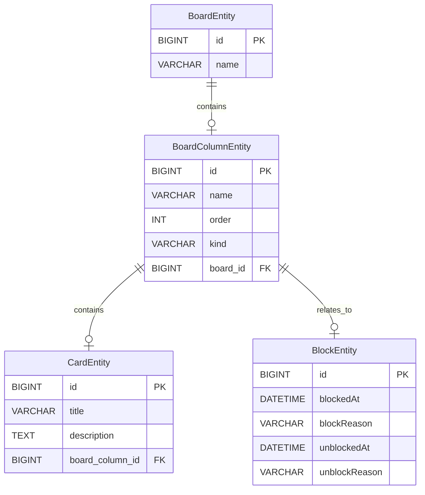

# Projeto de Board para Gerenciamento de Tarefas

Este projeto é um sistema para gerenciamento de tarefas baseado em um board (quadro de tarefas), feito para um desafio do BootCamp Decola Tech da DIO.
## Funcionalidades

O sistema permite a criação de boards e cartões (cards) com funcionalidades de movimentação entre colunas, bloqueio/desbloqueio de cartões e geração de relatórios. Ele possui um menu de interação para o usuário manipular os boards e cards, e armazena os dados no banco de dados MySQL.

### Fluxo do Sistema

1. O sistema inicia com um menu interativo, oferecendo as seguintes opções:
   - Criar novo board
   - Selecionar board existente
   - Excluir boards
   - Sair do sistema

2. Um **board** é composto por várias **colunas** que armazenam **cards** com tarefas. Cada board deve ter:
   - 1 coluna inicial
   - 1 coluna final
   - 1 coluna de cancelamento
   - Quantas colunas do tipo "pendente" forem necessárias
   - Cada coluna tem seu nome, ordem e tipo (inicial, final, cancelamento ou pendente)

3. **Cards** possuem um título, descrição e status (bloqueado ou desbloqueado). Eles devem passar pelas colunas de acordo com a ordem definida, exceto quando movidos para a coluna de cancelamento.

### Funcionalidades de Manipulação

- **Criar e Excluir Boards**: Permite criar boards novos ou excluir os existentes.
- **Manipulação de Cards**:
  - Criar novos cards dentro das colunas
  - Mover cards entre as colunas
  - Bloquear e desbloquear cards com justificativas
  - Cancelar cards
- **Fechar Board**: Permite finalizar a manipulação de um board.

### Requisitos Opcionais

1. O sistema pode armazenar a data e hora de movimentação dos cards entre as colunas.
2. Geração de relatórios:
   - **Relatório de tempo de conclusão de tarefas**: Inclui o tempo que cada tarefa levou em cada coluna.
   - **Relatório de bloqueios de cards**: Mostra o tempo que um card ficou bloqueado, com justificativas de bloqueio e desbloqueio.

## Diagrama de Entidades



## Requisitos

### Funcionalidades principais:
1. O código deve iniciar oferecendo um menu com as opções:
   - Criar novo board
   - Selecionar board
   - Excluir boards
   - Sair
2. O sistema deve salvar os boards no banco de dados MySQL.

### Regras para Boards:
1. Cada board deve ter pelo menos 3 colunas: inicial, final e cancelamento. As colunas pendentes são opcionais e podem ser criadas conforme necessário.
2. As colunas devem ter nome, ordem e tipo (inicial, final, cancelamento ou pendente). A coluna inicial deve ser a primeira, a final a penúltima e a de cancelamento a última.
3. Um card não pode pular etapas no board, exceto quando for movido para a coluna de cancelamento.
4. Cards bloqueados não podem ser movidos até serem desbloqueados.

### Menu de manipulação do board:
1. Permite:
   - Mover o card para a próxima coluna
   - Cancelar um card
   - Criar um card
   - Bloquear e desbloquear um card
   - Fechar o board

## Tecnologias Utilizadas

- **Spring Boot**: Framework para desenvolvimento de aplicações Java.
- **Java 17**: A versão do JDK utilizada para o desenvolvimento.
- **Liquibase**: Ferramenta para controle de versões do banco de dados.
- **MySQL**: Banco de dados utilizado para armazenar as informações.
- **Migrations**: Estratégia para migrar e versionar a estrutura do banco de dados.

3. **Execute o projeto**:
   - Execute o projeto com Maven ou Gradle:
     ```bash
     ./mvnw spring-boot:run
     ```
